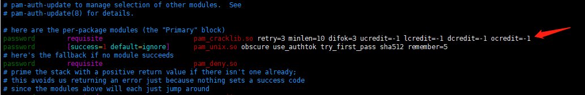

更新于2022.4.11==

写在开始：以下所有操作默认使用root账号完成

# 常用 命令

adduser, alias, awk, **bash**, **cat**, **cd**, chgrp, **chmod**, chown, cmake, **conda**, **cp**, curl, cut, dd, deluser, df, **dpkg**, du, **echo**, **exit**, **export**, fdisk, **find**, **git**, **grep**, **history**, **htop**, **id**, **ifconfig**, ll, **ln**, **locate**, **ls**, make, **man**, **mkdir**, mount, **mv**, **nvidia-smi**, **passwd**, **ping**, **pip**, **pwd**, **rm**, rz, **scp**, sed, service, set, smbclient, sort, **source**, **ssh**, **startxfce4**, su, systemctl , **sz**, **tar**, tee, test, **tmux**, top, **touch**, tr, **tree**, umount, uniq, unset, **unzip**, updatedb, userdel, **vi / vim**, wc, **wget**, whereis, which, who, **zip**, $, |, >>

# 信息查看

## CPU

```shell
# 查看CPU型号
cat /proc/cpuinfo | grep name | cut -f2 -d: | uniq -c
# 查看物理CPU个数
cat /proc/cpuinfo| grep "physical id"| sort| uniq| wc -l
# 查看每个物理CPU的核数
cat /proc/cpuinfo| grep "cpu cores"| uniq
# 查看总线程数 = 单个CPU线程数 * CPU个数
cat /proc/cpuinfo| grep "processor"| wc -l
```

## 硬盘

```shell
# 查看硬盘个数&容量
fdisk -l
# 查看硬盘分区 & 挂载情况
df -lh
```

# 挂载新硬盘并迁移home目录

一般服务器是为了节省成本的同时提升性能，将系统安装在固态硬盘上，将数据放在机械硬盘上，这里是将大小为8T的硬盘挂载到home目录下，以解决服务器内存不够的问题

- ==查找磁盘信息==

查看硬盘信息：使用命令`lshw -C disk`
其中8T的硬盘就是需要挂载的。 

```shell
*-disk:0                
      description: SCSI Disk
      product: MR9361-8i
      vendor: AVAGO
      physical id: 2.0.0
      bus info: scsi@6:2.0.0
      logical name: /dev/sda
      version: 4.68
      serial: 003bd7df0683ae9b24b06edd0eb00506
      size: 223GiB (239GB)
      capabilities: partitioned partitioned:dos
      configuration: ansiversion=5 logicalsectorsize=512 sectorsize=4096 signature=2d550c58
*-disk:1
      description: SCSI Disk
      product: MR9361-8i
      vendor: AVAGO
      physical id: 2.1.0
      bus info: scsi@6:2.1.0
      logical name: /dev/sdb
      version: 4.68
      serial: 0049b4430789ae9b24b06edd0eb00506
      size: 7451GiB (8TB)
      capabilities: gpt-1.00 partitioned partitioned:gpt
      configuration: ansiversion=5 guid=57d31fee-70a0-41f4-bcb9-b7b72f94fac4 logicalsectorsize=512 sectorsize=512
```


查看分区情况：使用命令`fdisk -l | grep sd`  
```shell
 Partition 2 does not start on physical sector boundary.
Disk /dev/sda: 223.1 GiB, 239511535616 bytes, 467795968 sectors
/dev/sda1  *       2048   1499135   1497088   731M 83 Linux
/dev/sda2       1501182 467793919 466292738 222.4G  5 Extended
/dev/sda5       1501184 467793919 466292736 222.4G 8e Linux LVM
Disk /dev/sdb: 7.3 TiB, 8000450330624 bytes, 15625879552 sectors
/dev/sdb1   2048 15625879518 15625877471  7.3T Linux filesystem
```
可以看到所有的存储设备，这里的sdb就是需要挂载到home的硬盘，这是已经挂载后的信息，其中sdb1就是将sdb中所有的内存划分出来的。

- ==挂载前设置硬盘==
  
  - ==硬盘小于2T设置方法==：使用命令`fdisk /dev/sdb`得到
  
    ```shell
    Welcome to fdisk (util-linux 2.27.1).
    Changes will remain in memory only, until you decide to write them.
    Be careful before using the write command.
    
    
    Command (m for help): 
    ```
  
    接着就是一些列命令行交互输入，输入 m 可看到所有的可用输入。大概知道了怎么操作之后，跟着下文的提示操作即可。
  
    - 输入 p 查看 `/dev/sdb` 分区的状态
    - 输入 n 创建 sdb 这块硬盘的分区
    - 选 `p primary` => 输入 `p`
    - Partition number` => 全部存储分一个区，所以输入 `1`
    - 接下来选项默认即可
    - 最后一步输入 `w` 保存并退出 Command 状态
  
  - ==硬盘大于2T设置方法：==这里是用的是parted软件。使用命令`parted /dev/sdb`进入交互界面，进行如下操作
  
    - 输入查看`/dev/sdb` 分区的状态
    
    - 输入`mklabel gpt`：选择`yes`，将硬盘转化为gpt格式，从而分区能大于2T
    
    - 接下来使用`mkpart`进行分区，命令格式为
  ```shell
      mkpart 分区名 文件类型 硬盘起始位置 硬盘结束位置
      # 例如
      mkpart sdb1 ext4 0 100%
      # 出现Ignore/Cancel选择Ignore
  ```
  
    这时用p查看可以看到一个sdb1空间
  
  
  
  ​		分区成功选择格式进行格式化
  
  ```shell
  mkfs.ext3 /dev/sdb1 或 mkfs.ext4 /dev/sdb1
  ```
  
- **==迁移旧的 home 目录文件到新硬盘==**：首先，你得挂载已经分区好的硬盘，然后把 home 目录下的全部文件拷贝到硬盘挂载的目录下。然后删除 home 目录，最后把第一步挂载好的新硬盘重新挂载在 home 目录下。具体步骤如下：

  这部分的内容得使用 root 用户登录主机，因为涉及到把 home 目录删除，所有的非 root 用户都会失效。

  挂载设置好的硬盘

  ```
  mkdir /mnt/tmp
  mount /dev/sdb1 /mnt/tmp
  ```

  同步 home 目录所有文件，删除之前的 home 目录下的所有文件 

  ```
  rsync -avx /home/ /mnt/tmp
  ```

  确定同步成功之后，删除旧 home 目录

  ```
  rm -rf /home/*  
  ```
  
  重新挂载新硬盘并设置启动挂载
  
  ```
  umount /mnt/tmp
  mount /dev/sdb1 /home
  ```
  
- ==设置系统启动挂载需要得到硬盘的信息==：使用命令`blkid`得到

  ```shell
  /dev/sda1: UUID="C66C-9691" TYPE="vfat" PARTUUID="1ee5a936-c71f-4adf-8293-067327bbc923"
  /dev/sda2: UUID="ff05ed6f-e987-43fe-943d-3b98d7537470" TYPE="ext4" PARTUUID="19ddc8d9-3485-45c2-b706-982953372aa2"
  /dev/sda3: UUID="d8a116c9-77b8-4eb8-9441-8f65bd6e68b7" TYPE="swap" PARTUUID="5406006c-3ba0-417b-998c-b7704d12e7c7"
  /dev/sda4: UUID="9ab168c1-9036-4106-b426-af205237efda" TYPE="ext4" PARTUUID="940cc2f6-1538-46d5-9332-be87a0e5d6a2"
  /dev/sdb1: UUID="49f276a9-0377-4489-b0d8-c94519d113ff" TYPE="ext4" PARTLABEL="data" PARTUUID="15685513-de76-47dd-9a75-2c164d0109f0"
  ```

  获取到的 sdb1的UUID 和 TYPE 在下文会用到。接着编辑 `**/etc/fstab**` 文件,把以下代码添加到最后 

  ```shell
  UUID=74c0eb7f-a03b-4520-89fc-36a618849699  /home           ext4    defaults      0      2
  ```

- ==结束==：运行 `df -h` 即可看到我们新挂载在 home 目录的硬盘设备
  

# LVM

在重装系统时，进行分区时，会遇到有些原先的分区无法删除的情况，即LVM卷组，这时我们需要先把LVM卷组删除掉，再重新分配空间。推荐教程
https://www.cnblogs.com/kerrycode/p/4569515.html


# 网络

## 查看端口是否占用

- 方法一：使用`lsof`命令

    ```shell
    lsof -i:端口号
    # 例如要查看23333端口是否被占用
    # 例如要查看23333端口是否被占用
    lsof -i:23333
    ```

## 固定IP地址&修改DNS

为了防止其他设备抢先占用了IP地址，到路由器云管理后台，网络设置 -> DHCP设置 -> DHCP静态分配，通过名字找到主机，记录下它的MAC，然后给一个IP地址

首先命令`ifconfig`查看网卡名字，比如`eno1`

- 方法一（==ubuntu16.04==）：编辑文件`/etc/network/interfaces`，填入以下内容

    ```shell
    # added by xzf 2021.1.27
    auto eno1
    iface eno1 inet static
    address 192.168.1.101
    netmask 255.255.255.0
    gateway 192.168.1.2
    dns-nameservers 223.5.5.5	# 这个未验证！！！xzf,2021.3.4
    ```
    
    然后重启
    
    ```shell
    /etc/init.d/networking restart
    ```
    
    PS：网关可以在路由器中查看。机房路由器的网关为`192.168.1.2`
        

- 方法二（==ubuntu 18.04及以上==）：使用`netplan`（一般都有的）

    ```shell
    apt install netplan
    ```
    
    编辑文件`/etc/netplan/01-netcfg.yaml`，添加如下内容（以102为示例）
    
    ```
    network:
        version: 2
        renderer: networkd
        ethernets:
           eno1:
              dhcp4: no
              addresses: [192.168.1.101/24]
              gateway4: 192.168.1.2
              nameservers:
                 addresses: [223.5.5.5, 223.6.6.6]
    ```
    
    然后使用命令`netplan try`测试配置是否有问题，如果没有问题就按回车确认生效
    
    **==注意==**：如果`/etc/netplan/`下已经有一个名为`50-cloud-init.yaml`，则按照里面注释说的修改相应文件，然后重启（或者重启服务？）
    
    
    
    > 参考教程：[如何在 Linux 上使用网络配置工具 Netplan](https://zhuanlan.zhihu.com/p/46544606)（教程中的示例有错，单词应该都是小写字母开头）


- 方法三（只设置DNS的）：编辑`/etc/systemd/resolved.conf`，作如下修改

    ```shell
    DNS=223.5.5.5
    FallbackDNS=223.6.6.6
    ```

    然后输入命令`systemctl restart systemd-resolved`
    
- 方法四（只设置DNS的）：使用`resolvconf`

    ```shell
    apt install resolvconf
    ```

    编辑`/etc/resolvconf/resolv.conf.d/base`（可能是个空文件），添加如下内容

    ```shell
    nameserver 223.5.5.5
    nameserver 223.6.6.6
    ```

    然后运行命令`resolvconf -u`使其生效

## 开启SSH服务远程登陆

```shell
apt install openssh-server
```

## 网络防火墙设置

待补充。。。

```shell
# 查看防火墙状态
ufw status
# 开启防火墙
ufw enable
# 关闭防火墙
ufw disable
```

# 系统设置

注意：系统环境变量的添加统一添加到文件`/etc/bash.bashrc`。因为非密码登陆并不会使用文件`/etc/profile`，但无论如何一定会用`/etc/bash.bashrc`

## （总结）/etc/bash.bashrc添加内容

根据以下内容总结出需要在`/etc/bash.bashrc`中添加的内容为：

```shell
# xzf 2021.4.23
export HISTTIMEFORMAT="%F %T "
export force_color_prompt=yes
# export PATH=/usr/local/Matlab/R2018a/bin:$PATH
export PATH=/opt/pycharm-community/bin:$PATH
export PATH=/opt/clion/bin:$PATH
export PATH=/opt/miniconda3/bin:$PATH
export PATH=/usr/local/cuda/bin:$PATH
IP=192.168.1.109
Port=7890
proxyon(){
    export http_proxy="http://${IP}:${Port}"
   export https_proxy="http://${IP}:${Port}"
   #    export http_proxy="socks5://${IP}:${Port}"
   #    export https_proxy="socks5://${IP}:${Port}"
    echo "proxy on, and IP is $(curl ip.sb)"
}
proxyoff(){
    unset http_proxy
    unset https_proxy
    echo "proxy off"
}
gitproxyon(){
    git config --global http.proxy http://$IP:$Port 
    git config --global https.proxy http://$IP:$Port
    echo "git proxy on"
    echo "Warning: Don't forget to turn it off manually after use"
    echo "The command to close is 'gitproxyoff'"
}
gitproxyoff(){
    git config --global --unset http.proxy
    git config --global --unset https.proxy
    echo "git proxy off"
}

```

### 终端代理设置

这里使用的是ljd的windows开启的代理。如果换IP地址和端口了需要更改。


```shell
##### Linux #####
# 将如下内容添加到/etc/bash.bashrc
IP=192.168.1.109
Port=7890
proxyon(){
	export http_proxy="http://${IP}:${Port}"
	export https_proxy="https://${IP}:${Port}"
	#    export http_proxy="socks5://${IP}:${Port}"
	#    export https_proxy="socks5://${IP}:${Port}"
	echo "proxy on, and IP is $(curl ip.sb)"
}
proxyoff(){
  unset http_proxy
  unset https_proxy
  echo "proxy off"
}

##### Windows #####
set http_proxy=http://192.168.1.111:7890
set https_proxy=https://192.168.1.111:7890
curl.exe ip.sb
# Windows的我不知道怎么设置函数
# 取消为
set http_proxy=
set https_proxy=
```


Linux，可以在终端中运行命令`proxyon`打开代理，只对当前终端有效。想要取消的话运行命令`proxyoff`

Windows则直接在终端中输入上面的命令，同样只对当前终端有效。

打开代理后，会输出一个ip地址，可以自己去网上查一下这个IP地址的位置，如果不是在大陆的话说明代理成功。  

> 参考教程：[让 Zsh 终端走代理](https://fangzf.me/2017/05/08/%E8%AE%A9-Zsh-%E7%BB%88%E7%AB%AF%E8%B5%B0%E4%BB%A3%E7%90%86/)

### 命令行提示符添加颜色

默认的命令行提示符为白色，很容易淹没在各种命令的输出当中，不容易找到。给提示符加上颜色，可以方便寻找定位

由于用户环境变量文件`~/.bashrc`会覆盖系统环境变量文件`/etc/bash.bashrc`中对于命令行颜色的直接修改（`PS1`），而且其实`~/.bashrc`中是有开启颜色的选项的


- **全局开启命令行提示符的颜色**：系统的bash环境变量文件`/etc/bash.bashrc`中添加如下命令

  ```shell
  export force_color_prompt=yes
  ```

  注意：直接在`/etc/profile`和`/etc/bash.bashrc`中添加下面的自定义颜色命令是没有用的，因为会被覆盖！

- **用户自定义提示符颜色**：在用户的bash环境变量文件`~/.bashrc`中添加如下命令

  - 格式一：`用户名@主机名:当前完整路径`

    ```shell
    export PS1="\[\e[36;1m\]\u\[\e[0m\]@\[\e[33;1m\]\h\[\e[0m\]:\[\e[31;1m\]\w\[\e[0m\]\\$ "
    ```

  - 格式二：`[用户名@主机名 当前简略路径]`

    ```shell
    export PS1="[\[\e[36;1m\]\u\[\e[0m\]@\[\e[33;1m\]\h \[\e[31;1m\]\W\[\e[0m\]]\\$ "
    ```

    > 其中，`\[\e[36;1m\]`表示蓝色，`\[\e[0m\]`表示白色，`\[\e[33;1m\]`表示黄色，`\[\e[31;1m\]`表示红色；`\u`表示用户，`\h`表示主机名(hostname)，`\w`表示当前的完整路径（`\W`表示当前的简略路径）
    > 如果要加换行的话加转义字符\n，其他一样

下次登陆以后提示符就会变成彩色的了。如果想要立马变成彩色，可以添加好后重新注入环境变量
```shell
source /etc/bash.bashrc
```

>参考教程：[Bash美化](https://www.cnblogs.com/xiamuyouren/p/3273114.html)、[Linux终端bash美化教程](https://blog.csdn.net/iweaming/article/details/49786725)


### history命令中显示时间和操作者

在文件`/etc/bash.bashrc`中添加如下内容

```shell
export HISTTIMEFORMAT="%F %T "
# export HISTTIMEFORMAT="%F %T `who am i` " # `who am i`这个好像不对，因为我用root权限su到其他账号，显示的操作者都是我自己
```

> 参考：[linux中，history命令，显示时间戳？操作人？IP地址？](https://www.cnblogs.com/chuanzhang053/p/10523133.html)

## SSH禁用密码登陆，使用密钥登录

编辑`/etc/ssh/sshd_config`文件
```shell
#启用密钥登陆。第一个可能会没有
RSAAuthentication yes
PubkeyAuthentication yes
#禁止root远程登陆
PermitRootLogin no
#禁止密码登陆
PasswordAuthentication no
```

重启ssh服务

```shell
service sshd restart
```

**注意**：可能需要先删除服务器上所有的密钥，防止已有密钥发生泄漏。由于生成密钥的时候可以指定路径，并且ssh不提供删除所有密钥的相关命令，所以删除的思路是找到所有公钥删除，同时删除私钥（路径就比公钥少了'.pub'），此外还要删除

```shell
for i in $(locate .pub|grep .pub)
do
	u=$(ll $i|awk '{printf $3}')
	if[ 999 -lt $(id -u $u) ]
		then
			echo del $u $i
		else
			echo save $u $i
	fi
done
```

>参考教程：[设置 SSH 通过密钥登录](https://hyjk2000.github.io/2012/03/16/how-to-set-up-ssh-keys/)、[ssh修改登录端口禁止密码登录并免密登录](https://www.jianshu.com/p/b294e9da09ad)

## 设置用户密码复杂度

安装所需软件

```shell
apt install libpam-cracklib
```

编辑文件`/etc/pam.d/common-password`完成相应设置：

- 禁止使用旧密码：在下图中相应位置后面添加`remember=5`，表示**禁止使用最近用过的5个密码**，己使用过的密码会被保存在`/etc/security/opasswd`

  

- 设置最短密码长度：**修改`minlen`的值为8**

  

- 设置密码复杂度：找到如下配置，**在后面添加`ucredit=-1 lcredit=-1 dcredit=-1 ocredit=-1`**，它表示密码必须至少包含一个大写字母（ucredit），一个小写字母（lcredit），一个数字（dcredit）和一个标点符号（ocredit），

  

编辑文件`/etc/login.defs`完成相应设置：

- 设置密码过期期限：找到如下配置，默认为9999天相当于不限制，到期之前7天会提示用户修改密码，**分别修改为180和30**

  

> 参考资料：[Ubuntu修改密码及密码复杂度策略设置](https://blog.csdn.net/ywd1992/article/details/107548282)

## 中文支持

1. 安装中文语言包
```shell
apt install language-pack-zh-hans*
```
2. 勾选中文编码：
- **方法一：**  

  ```shell
  dpkg-reconfigure locales
  ```

  在`zh_CN.GBK GBK`和`zh_CN.UTF-8 UTF-8`前面打勾将其添加到系统（左图），然后系统语言还是选择`en_US.UTF-8`（右图）
    

- **方法二：** 编辑`/etc/locale.gen`，将`zh_CN.GBK GBK`和`zh_CN.UTF-8 UTF-8`的注释去掉，然后运行

  ```shell
  locale-gen
  ```

3. 安装中文字体：

   ```shell
   #都是网上查的
   apt install fonts-droid-fallback fonts-wqy-zenhei fonts-wqy-microhei fonts-arphic-ukai fonts-arphic-uming fonts-noto fonts-noto-mono
   ```

   
---
## 修改主机名

编辑文件`/etc/hostname`，将里面的内容改成主机名即可，修改完成后重启。主机名格式为“IIPL-{ID}”，例如102服务器的主机名为“IIPL-102”

## 终端根据历史补全命令

编辑`/etc/inputrc`，搜索关键字`history-search`找到如下两行，取消注释。保存退出后即可通过`PgUp`和`PgDn`根据历史补全命令


## 禁止内核更新

由于nvidia驱动安装的时候是匹配当前内核，更新内核的话可能导致驱动崩掉

```shell
apt-mark hold linux-image-generic linux-headers-generic 
```


注意：如果之前忘了禁止内核更新，并且内核更新后驱动崩掉了，可以使用下面的方法将内核切换回旧的内核 & 删除新的内核 & 禁止内核更新

- 首先，查看当前内核 & 已经安装的内核

  ```shell
  # 查看当前内核
  uname -r
  # 查看已安装内核列表
  dpkg --get-selections | grep linux-image
  ```
  
  
  
- 然后，将系统的内核切换到旧的

  - 方法一：开机的时候，在grub引导界面，选择Advanced options for ubuntu，然后选择旧的内核进入即可（不要选择带“recover”字样的）

    

  - 方法二：修改grub引导顺序。查看服务器启动内核的顺序

    ```shell
    grep menuentry /boot/grub/grub.cfg
    ```

    

    红框内就是ubuntu系统目前所拥有的内核版本与启动顺序，menuentry就是每一条，记住这个顺序。

    比如我们要切换成5.8.0-43-generic这个，它在上图中的启动顺序是第4个。

    编辑文件`/etc/default/grub`，将GRUB_DEFAULT=0 修改为 GRUB_DEFAULT="1> 3"。

    PS：> 与7之间有个空格

    

    更新grub，然后重启

    ```shell
    update-grub
    reboot now
    ```

- 然后，删除所有最新的内核。比如这边要删除的是5.8.0-55版本的。首先查看该内核都安装哪些相关的软件，然后删除，再清除残留配置

  ```shell
  # 查看相关软件
  dpkg -l |grep linux|grep 55
  # 删除找到的所有相关软件。可能不一样，以实际情况为准
  apt remove linux-image-5.8.0-55-generic linux-image-unsigned-5.8.0-55-generic linux-modules-5.8.0-55-generic linux-headers-5.8.0-55-generic linux-hwe-5.8-headers-5.8.0-55
  # 清除残留配置
  dpkg -l | grep ^rc | cut -d' ' -f3 | xargs dpkg --purge
  ```

- 正常情况下`/boot/grub/grub.cfg`中应该就没有5.8.0-55的字样了，还有的话，回去检查一下是不是有东西没有删干净

- 编辑文件`/etc/default/grub`，将GRUB_DEFAULT修改为 GRUB_DEFAULT=0。

- 最后再更新一下grub，然后重启，看看内核版本正不正常

  ```shell
  update-grub
  reboot now
  ```

# 必装软件

## 更换系统镜像源

==**注意**==：如果使用科技馆502的网络，不建议更换镜像源，尤其是清华镜像。因为默认的源速度可以了，换了以后可能速度反而更差！

将系统镜像源换为[清华镜像源](https://mirrors.tuna.tsinghua.edu.cn/help/ubuntu/)or[阿里镜像源](https://developer.aliyun.com/mirror/ubuntu?spm=a2c6h.13651102.0.0.3e221b119vwOjw)

或者可以使用[apt-smart](https://pypi.org/project/apt-smart/)来检测链接状态最好的镜像源，不过需要python的支持。使用方法如下

```shell
# 安装
pip install apt-smart
# 使用
apt-smart -l
```

然后更新软件列表

```
apt update
```

## 必装软件集合

| 软件名称 | 说明        | 安装方法                      |
| -------- | ------ | -------- |
| vs code  | 代码编辑器                    | [官网](https://code.visualstudio.com/Download)下载.deb格式安装包 |
| tmux     | 终端分屏       | apt install tmux          |
| xfce4    | GUI桌面    |  apt install xfce4  |
| nethogs  | 查看网速    | apt install nethogs slurm         |
| cmake / ccmake | 工程构建 | apt install cmake cmake-curses-gui |
| make     | 编译   | apt install make            |
| gcc      | 编译      | 各个版本都装一遍，需要啥版本就把软连接指向啥版本！<br>apt install g++-4.8 g++-5 g++-6 g++-7 g++-8 |
| g++      | 编译         | 各个版本都装一遍，需要啥版本就把软连接指向啥版本！<br>apt install gcc-4.8 gcc-5 gcc-6 gcc-7 gcc-8 |
| zip rar  | 压缩        | apt install zip unzip rar unrar |
| dos2unix | DOS格式的文本文件转成UNIX格式 | apt install dos2unix   |
| gdb      | 程序调试器（可以查看段错误）  | apt install gdb        |
| build-essential | 包含了很多开发必要的软件 | apt install build-essential |
| git | 分布式版本控制 | apt install git |
| cracklib | 用户密码检查 | apt install libpam-cracklib |
| gio | 用于普通用户挂载samba（18.04自带） | apt install libghc-gio-dev |
| smbclient | samba的客户端，不能挂载 | apt install smbclient |
| slurm | 集群管理和作业调度系统 | apt  install slurm-client |
| XnView MP | 图片查看 | [官网](https://www.xnview.com/en/xnviewmp/)下载.deb格式安装包 |
| x2go | 远程图形界面 | server: apt install x2goserver x2goserver-xsession<br>（跳板机）client: apt install x2goclient |
| VLC | 视频播放 | apt install vlc |
| pycharm-community | python IDE | [官网](https://www.jetbrains.com/zh-cn/pycharm/download/#section=linux)下载压缩包，解压后放到/opt下，并添加环境变量or进行注册 |
| clion | C++ IDE | [官网](https://www.jetbrains.com/zh-cn/clion/download/#section=linux)下载压缩包，解压后放到/opt下，并添加环境变量or进行注册 |
| xrdp | 远程控制 | apt install tightvncserver xrdp |
| WPS | 办公软件 | [官网](https://linux.wps.cn/)下载.deb格式安装包 |

**整合如下**：

```shell
apt update
apt install vim openssh-server tmux net-tools -y
apt install x2goserver x2goserver-xsession curl -y
apt install unzip zip rar unrar git cmake-curses-gui gedit clang htop tree lrzsz samba smbclient cifs-utils tightvncserver xrdp vlc -y
apt install gcc g++ cmake gdb build-essential make libpng-dev libboost-all-dev -y 
# 可选
apt install nethogs slurm dos2unix libpam-cracklib
apt install g++-4.8 g++-5 g++-6 g++-7 g++-8 gcc-4.8 gcc-5 gcc-6 gcc-7 gcc-8 -y
# ubuntu16.04的镜像源没有 gcc5 以上的版本，使用如下命令
apt-get install -y software-properties-common
add-apt-repository ppa:ubuntu-toolchain-r/test
apt update
apt install gcc-6 gcc-7 gcc-8 g++-6 g++-7 g++-8 -y
apt autoremove
# 跳板机安装
apt-get install x2goclient
# ubuntu server安装
apt install xfce4 nautilus
# 如果不能用gio挂载的话安装
apt install libghc-gio-dev
```
## Miniconda

推荐安装Miniconda而不是Anaconda。Anaconda里面有很多用不上的包，而且切换镜像源后容易报warning。

### 安装

- ==安装==：到[官网](https://repo.anaconda.com/miniconda/)or[清华镜像](https://mirrors.tuna.tsinghua.edu.cn/anaconda/miniconda/)上下载安装包。我比较喜欢安装最新的

下载好了后，启动安装程序。例如

```shell
bash Miniconda3-latest-Linux-x86_64.sh
```
接下来就进入安装界面了。下图为欢迎界面，按回车（ENTER）


然后是许可协议，按`q`直接略过

协议看完了问你是否同意，输入yes

然后`最重要`的一步来了——**安装路径的选择**。默认的安装路径是当前操作用户的个人文件夹。~~因为我是用root进行操作，而root的个人文件夹是根目录下的/root，所以这里的默认路径是/root/miniconda3。~~ 因为服务器是很多人都要用的，所以建议不要安装到某个用户的个人文件夹里面。可以安装到根目录下的`/opt`。（`/opt`的用途可以参见[这篇博客](http://www.blogjava.net/lifw/archive/2008/08/12/221474.html)）。  

>当然，也可以安装到默认路径下后，把整个文件夹挪到`/opt`。只不过需要到环境变量里面改一下miniconda的路径

所以，安装路径选择`/opt/miniconda3`


>如果你下载的安装包是python 2.x的，那你路径中应该是`miniconda2`而不是`miniconda3`。~~当然也可以是`miniconda456`，只不过是个文件夹的名字罢了。~~

接下来就是一大段自动执行的安装代码。
接着让你选择是否要让安装器修改你个人的bash的环境变量文件。这个选择`yes`or`no`都无所谓，因为待会儿要修改系统的环境变量来让所有用户都可以用。 

**安装结束！**  

- ==配置系统环境变量==：为了让所有用户在登录以后可以直接使用miniconda，需要将miniconda的路径添加到系统环境变中。
  编辑系统环境变量文件`/etc/bash.bashrc`

>也有可能文件名为`/etc/bashrc`。
>此外，你也可以选择编辑另一个系统环境变量文件/etc/profile。如果你选择这个文件的话，切换了账号，需要重新注入环境变量，会比较麻烦！
>各种系统环境变量文件的加载顺序如下，可以参考这个[视频](https://www.imooc.com/video/7003)


在最后一行加入如下代码。其中`/opt/miniconda3`是你的安装路径
```shell
export PATH=/opt/miniconda3/bin:$PATH
```
>如果你在上面安装的时候，在“让你选择是否要让安装器修改你个人的bash的环境变量文件”选择了yes，那你可以把`~/.bashrc`中关于miniconda的一大段代码都复制出来，添加到环境变量文件中。
>我也不知道那一大段代码跟上面那一行`export ...`有什么区别:)


保存退出，重新注入环境变量
```shell
source /etc/bash.bashrc
```
>注意：
>
>1. 注入变量的时候最好不要用fish等其他shell，而是用默认的shell。~~如果你看不懂前面那句话的话就不要管它啦~~

- ==更换镜像源==：如果使用的是502的网，建议不要更换清华镜像，可以使用中科大镜像。
  
  以[清华镜像源](https://mirror.tuna.tsinghua.edu.cn/help/anaconda/)为例。**建议**进入它们的官网查看最新的更换镜像源命令，因为可能会有变动。
  
  注意：只能修改用户自己的镜像源，即便root用户也是如此（全局的方法我目前还不知道）
  为了方便大家，我搬运过来了：编辑`~/.condarc`文件，内容替换为如下

- ==创建公用环境==：创建**公用**环境的时候要把路径选择到安装路径/opt下面，使用`root账号`

```shell
#在/opt/miniconda3/envs/里创建一个名为py27的环境，其使用的python版本为2.7
conda create -p /opt/miniconda3/envs/py27 python=2.7
```
**原因如下**：添加的环境要求**所有人**都可以用。但是如果用`conda create -n python27 python=2.7`这个命令将会在用户的个人文件加下创建环境（root账户也算是”个人账户“），导致其他人不可以用这个环境。比如下图，我用xzf的账号创建了一个叫python36的环境，用test账号就不能检测到那个环境（但是root好像可以检测到）。


如此做的**优点**：
1. 普通账户只能在自己的个人文件下创建环境，不能在`/opt/miniconda3/envs/`里创建
2. 普通账户可以使用创建在`/opt/miniconda3/envs/`里的所有环境，但是不能对其进行修改（安装or删除软件等）


## 英伟达显卡驱动安装

最新内容参考[这篇博客](https://blog.csdn.net/OTZ_2333/article/details/108604064)

`推荐博客`：[How to install Nvidia drivers and cuda-10.0 for RTX 2080 Ti GPU on Ubuntu-16.04/18.04](https://medium.com/@avinchintha/how-to-install-nvidia-drivers-and-cuda-10-0-for-rtx-2080-ti-gpu-on-ubuntu-16-04-18-04-ce32e4edf1c0)

0. 卸载Nvidia残余文件。

      如果系统是新装的，还没有安装过任何nvidia的东西，可以跳过这一步直接到后面。如果电脑已经安装过nvidia的驱动了，==推荐==清理一下已经存在的nvidia文件

      ```shell
      # 上来就删！
      apt remove *cuda*
      apt remove *nvidia*
      /usr/bin/nvidia-uninstall
      # 下面这句可要可不要吧。不过我一般都加上的，删的干干净净的不好嘛
      apt autoremove
      
      # 清除rc状态的软件（我直接全删了，不管是不是nvidia or cuda的）
      dpkg -l | grep ^rc | cut -d' ' -f3 | xargs dpkg --purge
      ```

      还可以用locate命令定位一下nvidia文件，比如用命令`locate nvidia`（先用命令`updatedb`更新一下数据库）。不过可能找到各种地方的路径，~~推荐~~可以手动删除`/usr`下面的文件，其他地方我也不敢乱删呀。这一步我觉得可以不做，把上面的做好了应该就ok了。

1. **禁用Nouveau的驱动**
    在`/etc/modprobe.d/blacklist.conf`最后添加如下代码：
    (用来禁用nouveau第三方驱动，之后也不需要改回来）

    ```shell
    blacklist nouveau
    options nouveau modeset=0
    ```

    然后执行

    ```shell
    update-initramfs -u
    ```

    重启后，执行以下代码，若没有显示则禁用成功

    ```shell
    lsmod | grep nouveau
    ```

    如果遇到这个问题 `perl: warning: Falling back to a fallback locale ("en_US.UTF-8")`

    ```shell
    apt install locales-all
    ```

2. **检测NVIDIA显卡型号**：

    命令行有三种方法

    ```shell
    #方法一：使用ubuntu-drivers-common这个软件`
    apt install ubuntu-drivers-common
    ubuntu-drivers devices
    #方法二
    lshw -numeric -C display //最好用sudo
    #方法三
    lspci -vnn | grep VGA
    ```

    也可以用其他方法。

    **然后下载[官方驱动](https://www.nvidia.com/Download/index.aspx)**，**我比较喜欢最新的版本**。推荐下载英文版的驱动，防止中文乱码。例如  

    ```shell
    wget http://us.download.nvidia.com/XFree86/Linux-x86_64/410.93/NVIDIA-Linux-x86_64-410.93.run
    ```

3. 关闭图形界面

    如果系统已经有图形界面（比如ubuntu desctop），最好**关闭一下图形界面**，否则会有下图的报错。**关闭之前要先切换到命令行界面**，使用快捷键`Ctrl`+`Alt`+`F1`（`F1`不行的话，就换成`F2`、`F3`...）。然后sudo权限运行命令

    ```shell
    service lightdm stop
    # 如果提示Failed to stop lightdm.service: Unit lightdm.service not loaded，可以不用管它，继续
    ```

    

4. 安装

    给驱动run文件赋予执行权限，然后运行

    ```shell
    chmod +x NVIDIA-Linux-x86_64-410.93.run
    ./NVIDIA-Linux-x86_64-410.93.run 
    ```

    也可以直接使用bash运行

    ```
    bash NVIDIA-Linux-x86_64-410.93.run
    ```

    启动安装程序，可以加参数（安装驱动前可能需要先安装gcc和make）。不过我一般都不加任何参数，如果想要加的话，可以加一个`--no-x-check`

    > 参数有：
    > `--no-opengl-files`：表示只安装驱动文件，不安装OpenGL文件。这个参数不可省略，否则会- 导致登陆界面死循环，英语一般称为”login loop”或者”stuck in login”。**然而我并没有用**
    > `--no-x-check`：表示安装驱动时不检查X服务。如果没有这个参数，可能会出现“X-Server needs to be disabled before installing the drivers”的错误。**然而我也没有用**
    > `--no-nouveau-check`：表示安装驱动时不检查nouveau，非必需。
    > `-Z, --disable-nouveau`：禁用nouveau。此参数非必需，因为之前已经手动禁用了nouveau。
    > `-A`：查看更多高级选项。

    安装过程中遇到的选择如下：

    

    
    
    
    

    如果出现如下界面，建议终止驱动安装（`Ctrl`+`c`），然后到bios里关闭安全启动，然后从第四步开始。否则可能会安装失败（反正我是没成功过）

    

5. 若遇到关于kernal的Error，应该是驱动版本和系统内核版本不匹配（图后面有机会补上吧）。

    方法一：下载更新版本（or更旧，一般都是更新吧）的驱动。推荐这个，因为我都成功了。

    方法二：更改内核的版本。具体应该切换到什么版本的内核，可以参考其他已经成功安装了显卡驱动的电脑的内核版本。查看当前使用的内核 `uname -r`，查看grub版本 `grub-install -V`，切换内核可以参考这个[博客](https://blog.csdn.net/u011304615/article/details/70920171)

6. 如果系统原本就有图形界面，并且执行了第3步，那安装完驱动后可以打开图形界面

    ```shell
    service lightdm start
    ```

    如果报错`Failed to stop lightdm.service: Unit lightdm.service not loaded`，需要重装一下`lightdm`
    

    ```shell
    apt install lightdm
    ```

    如果重启后，系统默认进入的是命令行界面而不是图形界面，

    ```shell
    # 查看当前启动模式。如果输出为multi-user.target，表示默认是命令行界面
    systemctl get-default
    # 将命令行模式更改为图形界面
    systemctl set-default graphical.target
    ```

## cuda、cudnn

### conda版本

用conda在指定环境下安装。可以直接安装cudnn，这样可以自动安装cuda，但要选择cuda版本对应的cudnn。比如这里在miniconda环境中安装cuda8，选择cudnn7.0.5（**自行选择适合的版本**）
例如


```shell
#python2.7, cudnn=7.0.5, cuda=8.0
conda install cudnn=7.0.5
```

### 官网版本

考虑到用conda安装的cuda在`/usr/local`下没有cuda的文件夹，对于一些c++的代码或者需要cuda路径的代码，方法一就不行了。而且conda安装的版本不包含nvcc编译器等东西。

安装教程参考英伟达官网上给出的[cuda文档](https://developer.nvidia.com/cuda-toolkit-archive)和[cudnn文档](https://developer.nvidia.com/rdp/cudnn-archive)

## Matlab
**根据本人在多台服务器上安装过多个版本的Matlab的经验，此教程适用于R2014a、R2016b、R2018a版本的Matlab。**
这里以 MatlabR2018a 命令行安装为例

- **安装包**：可以关注公众号“Linux资源库”，里面有安装包

-  **安装**：解压破解文件压缩包

```shell
tar -xvf Matlab2018aLinux64Crack.tar.gz 
```
由于安装包被分成了两个镜像，先挂载第一个  
```shell
mkdir /iso
mount -o loop R2018a_glnxa64_dvd1.iso /iso
```
转移配置文件。其中license_standalone.lic来自于破解压缩包  
>压缩包里面可能提供不止一个.lic文件，选择license_standalone.lic。但是也有可能破解压缩包只提供了一个.lic文件，只是这个文件可能不叫这个名字，可能叫license_405329_R2014a.lic，反正就是把.lic结尾的那个文件复制到安装目录下的install文件夹里面，然后在编辑activate.ini的时候注意一下文件名字

```shell
#/usr/local/Matlab/R2018a/install用来存放安装配置文件
mkdir /usr/local/Matlab/R2018a/install
cp license_standalone.lic /usr/local/Matlab/R2018a/install/
cp /iso/installer_input.txt /usr/local/Matlab/R2018a/install/
cp /iso/activate.ini /usr/local/Matlab/R2018a/install/
```

编辑`/usr/local/Matlab/R2018a/install/installer_input.txt`，用来配置安装选项

```shell
#这里所有R2018a按版本填写
#安装目录
destinationFolder=/usr/local/Matlab/R2018a
#你的序列号，不同版本的序列号可以去网上查。下面这个是2018a的
fileInstallationKey=09806-07443-53955-64350-21751-41297
#同意协议
agreeToLicense=yes
#安装日志（Optional）
outputFile=/tmp/mathwork_install.log
#开启无人值守安装
mode=silent
#选择激活文件
activationPropertiesFile=/usr/local/Matlab/R2018a/install/activate.ini
```
编辑`/usr/local/Matlab/R2018a/install/activate.ini`，用来配置激活选项
(不能直接复制粘贴到文件的最开始，要填到相应的位置，否则破解`应该`会报如下错误）


```shell
#开启silent模式
isSilent=true
#设置激活方式, 离线激活 无需联网
activateCommand=activateOffline
#license文件位置（来自于破解文件）
licenseFile=/usr/local/Matlab/R2018a/install/license_standalone.lic
```
执行安装命令  
```shell
/iso/install -inputFile /usr/local/Matlab/R2018a/install/installer_input.txt
```
提示如下文字后需要`重开一个终端`来卸载第一个镜像然后挂载第二个镜像


```shell
umount /iso
mount -t auto -O loop R2018a_glnxa64_dvd2.iso /iso
```
安装完成后提示还要有一大堆的步骤要操作，不过先不管了，安装成功了再说，那些操作后面有空弄。


- **激活**：先将破解文件中提供的所有.so文件都拷贝到安装路径下。
  如果破解文件提供的不是这样的一个文件夹而是很多的.so文件的话，则把所有的.so文件拷贝到/usr/local/Matlab/R2018a/bin/glnxa64/覆盖。可以提前把安装目录下对应的.so文件备份一下。

```shell
#比如
#破解文件提供了一个名为R2018a的文件夹，这个文件夹下面的文件结构跟安装路径里的一样，里面有.so的文件。
#直接拷贝那个文件夹到安装路径覆盖
cp -r ./Matlab2018aLinux64Crack/R2018a /usr/local/Matlab/
```
然后通过前面已经配置好的激活文件来进行激活
```shell
/usr/local/Matlab/R2018a/bin/activate_matlab.sh -propertiesFile /usr/local/Matlab/R2018a/install/activate.ini
```
出现`Silent activation succeeded`表示破解成功


- **添加环境变量**：编辑`/etc/profile`

```shell
export PATH=/usr/local/Matlab/R2018a/bin:$PATH
```
> 备注：当安装完所需几个版本matlab后，注意环境变量只能选择一个，其他版本注释，否则又冲突，需要什么版本再修改环境变量
- **启动测试**：出现下图的情况表示成功了！
  
  **如果报错**

```
Fatal Internal Error: Unexpected exception: 'N9MathWorks6System15SimpleExceptionE: Dynamic exception type: St13runtime_error
std::exception::what: Bundle#1 start failed: libXt.so.6: cannot open shared object file: No such file or directory
' in createMVMAndCallParser phase 'Creating local MVM'
```
​	执行
```shell
apt install x11-xserver-utils
xhost si:localuser:root
```
____
>参考教程：
>[Ubuntu 16.04安装MATLAB R2018a](https://blog.jiangyayu.cn/archives/ubuntu-matlab.html/)
>[服务器远程安装Matlab2015](https://blog.csdn.net/yixianfeng41/article/details/70215817)
>[linux安装MATLAB R2018a步骤](https://blog.csdn.net/m0_37775034/article/details/80876362)
>[linux命令行模式下安装matlab](https://blog.csdn.net/kexinmcu/article/details/52319134)

 

## Samba：Windows共享Linux文件夹

安装：[官网](https://wiki.samba.org/index.php/Main_Page)
```shell
apt install samba
```
>[官网给出的教程](https://wiki.samba.org/index.php/Distribution-specific_Package_Installation)还要安装`attr winbind libpam-winbind libnss-winbind libpam-krb5 krb5-config krb5-user`，但是ta好像是为了进行域管理，我们暂时不需要，就不用安装。

配置：在`/etc/samba/smb.conf`末尾添加
```shell
[xzf]
path = /home/xzf
valid users = xzf
force user = xzf
create mask = 0600
browseable = yes
available = yes
read only = no
writeable = yes
public = yes
```
>参数说明：
>[[xzf]](https://blog.csdn.net/ljxfblog/article/details/80177700)：共享目录的名称
>path：共享的目录
>[force user](https://blog.csdn.net/kris_fei/article/details/53186327)：使得操作的时候和服务端用户一样
>create mask：创建文件属性
>browseable：在浏览资源中显示共享目录，若为否则必须指定共享路径才能存取
>read only：加上只是为了以防万一
>writeable：不以只读方式共享当与read only发生冲突时，无视read only
>public：公开共享，若为否则进行身份验证(只有当security = share 时此项才起作用)  

添加一个普通账户，用于访问这个目录

```shell
#需要root权限
smbpasswd -a xzf
```
重启
```shell
#我在ubuntu 18.04和16.04测试的都是smbd，根网上的教程中用的smb或samba都不一样，可能是软件更新后命令不一样了吧
service smbd restart
```
Windows端，进入文件资源管理器，左侧列表里，对”网络“右键，添加”映射网络驱动器“，输入"\\\192.168.1.102\xzf"，输入前面用`smbpasswd`创建的用户名和密码。

## IDE

安装pycharm-community、vscode、clion，安装包去官网下载最新的

- vscode：主要用作高级文本编辑器。安装命令大致如下：

  ```shell
  dpkg -i code_1.54.3-1615806378_amd64.deb
  ```

- pycharm-community：python的IDE。community是免费的不用激活。安装方式：将压缩包解压后挪到/opt下，然后在环境变量PATH中添加bin的路径即可，大致如下：

  ```shell
  tar -zxvf pycharm-community-2021.1.tar.gz
  mv pycharm-community-2021.1 /opt/pycharm-community
  ```

  在环境变量/etc/bash.bashrc中添加如下内容：

  ```shell
  export PATH=/opt/pycharm-community/bin:$PATH
  ```

  **或者**执行如下命令

  ```bash
  update-alternatives --install /usr/bin/pycharm pycharm /opt/pycharm-community/bin/pycharm.sh 1
  update-alternatives --install /usr/bin/clion clion /opt/clion/bin/clion.sh 1
  ```

- clion：c++的IDE。安装方式与pycharm一样

## 安装搜狗拼音

1. 首先安装输入法框架fcitx，并删除ibus

   ```shell
   # 卸载ibus
   apt purge ibus
   dpkg -l|grep ibus # 再检查一下有没有遗漏，注意后面的描述带“Input Bus”才是要删除的（如下图），不要删错了
   # 安装fcitx
   apt install fcitx
   ```

   

2. 安装搜狗拼音：从[官网](https://pinyin.sogou.com/linux/)下载安装包，先安装依赖，再安装搜狗拼音

   ```shell
   # 安装依赖
   apt install libqt5qml5 libqt5quick5 libqt5quickwidgets5 qml-module-qtquick2sudo libgsettings-qt1
   # 安装搜狗拼音
   dpkg -i sogoupinyin_4.0.0.1605_amd64.deb
   # 如果报错了，使用如下命令
   apt install --fix-broken
   ```

   PS：如果报错信息为`sogoupinyin breaks fcitx-ui-qimpanel`，可以把它卸载了

   ```
   apt remove fcitx-ui-qimpanel
   ```

3. （可选）添加环境变量：在`/etc/xprofile`中添加如下内容。如果是ubuntu server，并且手动安装的xfce，需要完成该操作

   ```shell
   # xzf, 2021.5.5
   export XMODIFIERS=@im=fcitx
   export GTK_IM_MODULE=fcitx
   export QT_IM_MODULE=fcitx
   fcitx &
   ```

   上面代码的第五行是用来让fcitx随着图像界面的启动 自启动的，暂时找不到别的什么好方法了。

4. 添加搜狗拼音输入法：

   !

5. 如果出问题了，使用命令`fcitx-diagnose`查看日志（不要用sudo权限，否则会报错），里面红色的表示有问题，例如下图。不是所有的问题都要解决，通常要解决的有

   - 如果显示没有添加环境变量的话，在`/etc/environment`中添加前面的环境变量
   
     
   
   - fcitx-remote：如果日志里显示”Cannot connect to fcitx correctly“，可以在终端中输入`fcitx-remote`，输出为数字表示正常，输出为Not get reply，说明fcitx没有启动，可以使用命令`fcitx`启动
   
   - DBus interface：如果显示”Cannot find xxx“，很大可能是因为fcitx没有启动


# 库

## 各种库

| 库名称   | 说明             | 安装方法      |
| -------- | ---------------- | --------------------------------------------- |
| OpenGL | 计算机图形学库 | apt-get install libgl1-mesa-dev libglu1-mesa-dev freeglut3-dev<br/>可选（推荐，现成demo）：apt install mesa-utils |
| Eigen    | 矩阵处理         | apt install libeigen3-dev   |
| Pangolin | 可视化           | 依赖：apt install libgl1-mesa-dev libglew-dev<br>[git](https://github.com/stevenlovegrove/Pangolin)后用cmake编译安装 |
| Sophus   | 李代数           | 依赖：apt install libfmt-dev<br>[git](https://github.com/strasdat/Sophus)后用cmake编译（无需安装）  |
| [Ceres](http://ceres-solver.org/installation.html) | 求解最小二乘问题 | 依赖：apt install cmake libgoogle-glog-dev libgflags-dev libatlas-base-dev libeigen3-dev libsuitesparse-dev<br>[git](https://github.com/ceres-solver/ceres-solver)后用cmake编译安装 |
| g2o      | 基于图优化       | 依赖：apt install cmake libeigen3-dev libsuitesparse-dev qtdeclarative5-dev qt5-qmake qt5-default libqglviewer-dev-qt5 libcxsparse3 libcholmod3<br>[git](https://github.com/RainerKuemmerle/g2o)后用cmake编译安装 |
| [glog](https://github.com/google/glog) | 日志记录框架 | [git](https://github.com/google/glog)后用cmake编译安装 |
| OpenCV |计算机视觉库 | 见下面OpenCV专栏 |
| PCL | 点云库 | 见下面PCL专栏 |
|FLANN|最完整的（近似）最近邻开源库|见下面PCL专栏 |
| Boost | 为C++语言标准库提供扩展的一些C++程序库的总称 | 见下面PCL专栏 |
| VTK | 可视化工具库 | 见下面PCL专栏 |
| OpenNI | 开放自然交互。。。懂的都懂 | 见下面PCL专栏 |
| QHull | 计算几何库 | 见下面PCL专栏 |

整理成.sh如下：
```shell
# OpenGL
apt-get install libgl1-mesa-dev libglu1-mesa-dev freeglut3-dev
# OpenGL可选
apt install mesa-utils
# 安装这些依赖的时候好像会安装python2.7，我也不知道为啥。而且安装完后运行python会自动运行python2.7，不过重新注入环境变量了以后再运行python用的就是conda里面的python，所以我也就没有管它了。
apt install gcc g++ cmake build-essential make libpng-dev libboost-all-dev -y 
apt install libeigen3-dev liblapack-dev libcxsparse3 libgflags-dev libgoogle-glog-dev libatlas-base-dev libgtest-dev cmake libsuitesparse-dev qtdeclarative5-dev qt5-qmake qt5-default libqglviewer-dev-qt5 libcxsparse3 libcholmod3 libgl1-mesa-dev libglew-dev liblz4-dev libfmt-dev -y 
# 安装Pangolin出现‘No package ‘xkbcommon’ found’
apt install libxkbcommon-x11-dev

# Pangolin
git clone --depth=1 https://github.com/stevenlovegrove/Pangolin.git
cd Pangolin
mkdir build
cd build
cmake ..
make -j7
make install
cd ../..

# Sophus
git clone --depth=1 https://github.com/strasdat/Sophus.git
cd Sophus
mkdir build
cd build
cmake ..
make -j7
make install #可以不安装，但是我还是装了
cd ../..

# ceres
git clone -b 2.1.0 --depth=1 https://github.com/ceres-solver/ceres-solver.git
cd ceres-solver
mkdir build_
cd build_
cmake ..
make -j7
make install
cd ../..

# g2o
git clone --depth=1 https://github.com/RainerKuemmerle/g2o.git
cd g2o
mkdir build
cd build
cmake ..
make -j7
make install
cd ../..

# glog
git clone --depth=1 -b v0.6.0 https://github.com/google/glog.git
cd glog
cmake -S . -B build -G "Unix Makefiles"
cmake --build build
cmake --build build --target install
cd ..
```

## PCL

- 方法一：`apt install libpcl-dev`。一般版本都比较老。
> 注：网上的一些教程在命令行安装之前，会添加一个仓库`add-apt-repository ppa:v-launchpad-jochen-sprickerhof-de/pcl`，但是我试了一下，使用这个仓库会报错（没有 Release 文件），而且貌似里面的文件都比较老了（2015年之前）
- 方法二：源码编译安装（**推荐**）
1. 安装依赖以及第三方库：Boost，Eigen，FlANN，VTK，（OpenNI，QHull）
   ```shell
   # 必装：其中eigen和vtk一直在更新，安装名称中的数字可能会发生变化
   apt install build-essential libboost-all-dev libeigen3-dev libvtk7-dev
   # FLANN
   git clone --depth=1 https://github.com/flann-lib/flann.git
   cd flann
   mkdir build
   cd build
   cmake ..
   make -j7
   make install
   cd ../..
   
   # 可选
   apt install libqhull-dev lisusb-1.0-0 libopenni2-dev libopenni-dev
   ```
   PS：如果安装flann库的时候遇到下面的问题
   
   - cmake的时候报错`No SOURCES given to target: flann`，参考[这个链接](https://stackoverflow.com/questions/50763621/building-flann-with-cmake-fails)
   
   
   - make的时候，报错undefined reference to 'LZ4_resetStreamHC'啥的，且后面出现了matlab字样，则在cmake后面加个`-DBUILD_MATLAB_BINDINGS=OFF`
   
     
   
2. **从[GitHub](https://github.com/PointCloudLibrary/pcl)克隆源码**

```shell
git clone -b pcl-1.12.1 https://github.com/PointCloudLibrary/pcl.git
cd pcl && mkdir build && cd build
cmake ..
# 如果想要安装Release版本，运行命令cmake -DCMAKE_BUILD_TYPE=Release ..

make -j6 install
```

## OpenCV

### python
```shell
#只安装opencv
pip install opencv_python
#安装opencv + opencv_contrib
pip install opencv-contrib-python
```
查看可以安装的版本，在命令后面加上`==`，例如`pip install opencv_python==`
### C++

以下不保证最新，最新的内容可以看[我的博客](https://blog.csdn.net/OTZ_2333/article/details/104040394)

安装前一定先看一遍**官方教程**（[Installation in Linux](https://docs.opencv.org/4.2.0/d7/d9f/tutorial_linux_install.html)，[opencv_contrib](https://github.com/opencv/opencv_contrib)）和**以下全文**，尤其是最后的**问题**

以opencv 4.2.0版本为例，我`home`下的`Downloads`文件夹里有`opencv-4.2.0`、`opencv_contrib-master`和`opencv_need`三个文件夹，分别存放着opencv 4.2.0的源码、opencv contrib的源码和问题三中自己手动下载的所有文件  

```shell
#安装所有必须的软件和依赖项。如果显示E: Unable to locate package xxxx，把镜像源更换为清华的应该就能解决。
apt install libgtk2.0-dev pkg-config libavcodec-dev libavformat-dev libswscale-dev
#可选项。若libjasper-dev不能安装,参考问题一。除了python的两个，其他的我全装了（都是处理各种图片格式的库）
apt install python-dev python-numpy libtbb2 libtbb-dev libjpeg-dev libpng-dev libtiff-dev libjasper-dev libdc1394-22-dev

#获取源文件，git或者用IDM直接下载后传给linux解压
git clone --depth=1 https://github.com/opencv/opencv.git
git clone --depth=1 https://github.com/opencv/opencv_contrib.git

#进入opencv的文件夹
cd opencv
mkdir build
cd build

#如果报错，在-D后加个空格；
#-DOPENCV_EXTRA_MODULES_PATH=后面跟的是opencv_contrib的路径,因为我的opencv_contrib-master和opencv-4.2.0两个文件夹在同一个文件夹下
#-DBUILD_opencv_java和-DBUILD_opencv_python是用来选择是否要java和python的
# cmake -DCMAKE_BUILD_TYPE=RELEASE -DCMAKE_INSTALL_PREFIX=/usr/local -DOPENCV_EXTRA_MODULES_PATH=../../opencv_contrib/modules -DBUILD_opencv_java=OFF -DBUILD_opencv_python=OFF ..
cmake -DOPENCV_EXTRA_MODULES_PATH=../../opencv_contrib/modules -DBUILD_opencv_java=OFF -DBUILD_opencv_python=OFF ..
#若显示	-- Configuring done
#		-- Generating done
#则进行下一步，-j7表示多线程
make -j7 
make install
```
PS：如果cmake的时候，输出说`Could NOT find xxx`之类的，不要担心，只要不是让cmake终止的`error`都没问题。cmake成功后会显示`Configuring done`和`Generating done`  

**问题一**：安装可选依赖包libjasper-dev的时候，显示`E: Unable to locate package libjasper-dev`  
```shell
add-apt-repository "deb http://security.ubuntu.com/ubuntu xenial-security main"
apt update
apt install libjasper1 libjasper-dev
add-apt-repository --remove "deb http://security.ubuntu.com/ubuntu xenial-security main"
#其中libjasper1是libjasper-dev的依赖包
```
>参考教程：[Ubuntu18.04下安装OpenCv依赖包libjasper-dev无法安装的问题](https://blog.csdn.net/weixin_41053564/article/details/81254410)  

**问题二**：如果在`cmake编译`的时候，显示**No package 'gtk+-3.0' found**  
  

```shell
#以防万一，我觉得还是装了比较好
apt install libgtk-3-dev
```

**问题三**：如果在`cmake编译`的时候，需要到Github下载一些文件，但是下载不下来（终端翻墙可能也没用，反正我不行），例下图
  

+ *方法一*：需要手动下载每一个文件，并修改cmake文件中的文件路径。步骤如下：  
1. 打开下载所需文件对应的cmake文件。文件路径一般在报错下面的`Call Stack (most recent call first)`紧跟的第一行。例如  
  
2. 找到cmake文件中的需要下载文件的URL，例如`"https://raw.githubusercontent.com/opencv/opencv_3rdparty/${IPPICV_COMMIT}/ippicv/"`。其中的`${IPPICV_COMMIT}`在同一个文件中有定义，为一长串的字母数字组合的字符串。最后，在URL的最后加上文件名，同样也有定义，针对不同的系统与环境会有所不同；或者在cmake编译的时候看它的输出也行。  
得到最终的下载连接为 `"https://raw.githubusercontent.com/opencv/opencv_3rdparty/32e315a5b106a7b89dbed51c28f8120a48b368b4/ippicv/ippicv_2019_lnx_intel64_general_20180723.tgz"`  
  
3. 用**IDM**下载完后传给Linux，或者在linux上开代理下载，把.cmake文件里下载文件的URL改成
    ```shell
    "file://{刚刚手动下载的IPP文件的上一级目录}/"
    ```
    最后，我将自己所需手动下载的所有东西整理成了一个表格，**仅供参考**：  
|          文件名          |                                        .cmake文件位置                                        | 下载连接                                                                                                                                              |
| :----------------------: | :------------------------------------------------------------------------------------------: | :---------------------------------------------------------------------------------------------------------------------------------------------------- |
|          IPPICV          |                /home/orz/Downloads/opencv-4.2.0/3rdparty/ippicv/ippicv.cmake                 | https://raw.githubusercontent.com/opencv/opencv_3rdparty/32e315a5b106a7b89dbed51c28f8120a48b368b4/ippicv/ippicv_2019_lnx_intel64_general_20180723.tgz |
|     boostdesc_bgm.i      | /home/orz/Downloads/opencv_contrib-master/modules/xfeatures2d/cmake/download_boostdesc.cmake | https://raw.githubusercontent.com/opencv/opencv_3rdparty/34e4206aef44d50e6bbcd0ab06354b52e7466d26/boostdesc_bgm.i                                     |
|    boostdesc_bgm_bi.i    |                                             同上                                             | https://raw.githubusercontent.com/opencv/opencv_3rdparty/34e4206aef44d50e6bbcd0ab06354b52e7466d26/boostdesc_bgm_bi.i                                  |
|    boostdesc_bgm_hd.i    |                                             同上                                             | https://raw.githubusercontent.com/opencv/opencv_3rdparty/34e4206aef44d50e6bbcd0ab06354b52e7466d26/boostdesc_bgm_hd.i                                  |
| boostdesc_binboost_064.i |                                             同上                                             | https://raw.githubusercontent.com/opencv/opencv_3rdparty/34e4206aef44d50e6bbcd0ab06354b52e7466d26/boostdesc_binboost_064.i                            |
| boostdesc_binboost_128.i |                                             同上                                             | https://raw.githubusercontent.com/opencv/opencv_3rdparty/34e4206aef44d50e6bbcd0ab06354b52e7466d26/boostdesc_binboost_128.i                            |
| boostdesc_binboost_256.i |                                             同上                                             | https://raw.githubusercontent.com/opencv/opencv_3rdparty/34e4206aef44d50e6bbcd0ab06354b52e7466d26/boostdesc_binboost_256.i                            |
|     boostdesc_lbgm.i     |                                             同上                                             | https://raw.githubusercontent.com/opencv/opencv_3rdparty/34e4206aef44d50e6bbcd0ab06354b52e7466d26/boostdesc_lbgm.i                                    |
|    vgg_generated_48.i    |    /home/orz/Downloads/opencv_contrib-master/modules/xfeatures2d/cmake/download_vgg.cmake    | https://raw.githubusercontent.com/opencv/opencv_3rdparty/fccf7cd6a4b12079f73bbfb21745f9babcd4eb1d/vgg_generated_48.i                                  |
|    vgg_generated_64.i    |                                             同上                                             | https://raw.githubusercontent.com/opencv/opencv_3rdparty/fccf7cd6a4b12079f73bbfb21745f9babcd4eb1d/vgg_generated_64.i                                  |
|    vgg_generated_80.i    |                                             同上                                             | https://raw.githubusercontent.com/opencv/opencv_3rdparty/fccf7cd6a4b12079f73bbfb21745f9babcd4eb1d/vgg_generated_80.i                                  |
|   vgg_generated_120.i    |                                             同上                                             | https://raw.githubusercontent.com/opencv/opencv_3rdparty/fccf7cd6a4b12079f73bbfb21745f9babcd4eb1d/vgg_generated_120.i                                 |
| face_landmark_model.dat  |            /home/orz/Downloads/opencv_contrib-master/modules/face/CMakeLists.txt             | https://raw.githubusercontent.com/opencv/opencv_3rdparty/8afa57abc8229d611c4937165d20e2a2d9fc5a12/face_landmark_model.dat                             |
然后，所有`.cmake文件`的URL改成`"file:///home/orz/Downloads/opencv_need/"`  
PS: 尝试了opencv 3.4.x对应的opencv_contrib，发现所有需要手动下载的文件跟opencv 4.x的一致，所以`opecv_need`文件夹直接共用就好了。  
>参考教程：[手动安装OpenCV下的IPP加速库](https://www.cnblogs.com/yongy1030/p/10293178.html)  

+ *方法二*：对于不需要的`dnn`和`vgg`，可以在`cmake编译`的时候，在命令后面加上`BUILD_opencv_*`参数，比如：
```shell
#我没用过这个方法，不知道行不行得通
cmake -DOPENCV_EXTRA_MODULES_PATH=<opencv_contrib>/modules -DBUILD_opencv_legacy=OFF <opencv_source_directory>
```
>参考教程：[opencv_contrib](https://github.com/opencv/opencv_contrib)

**问题四**：报错`Duplicated modules NAMES has been found`，如下图

因为*版本不匹配*！！！opencv contrib也是分版本的！！！在从github上下载opencv contrib的时候，需要选择banch。`master`指的是最新的版本，即opencv 4.x，`3.4`应该指的是opencv 3.4.x的（不懂了，那3.4.x之前的版本咋办？），如图：
  

# 可选操作

## 安装VirtualGL（进阶，放到最后）

正常来说，ssh的X11 forward无法传输opengl的相关数据，因为要求渲染在ssh客户端完成。VirtualGL则可以强制要求渲染的过程在服务器上完成后再传过来。以下是安装步骤

0. 安装OpenGL

1. 根据[官方要求](https://rawcdn.githack.com/VirtualGL/virtualgl/3.0/doc/index.html#hd005001)，要先卸载已经安装的显卡驱动，然后从[官方网站](http://sourceforge.net/projects/virtualgl)下载deb安装包（32位可选）安装

   ```shell
   dpkg -i virtualgl_2.6.80_amd64.deb virtualgl32_2.6.80_amd64.deb
   apt install --fix-broken
   ```

2. 重装显卡驱动

3. 根据[官方说明](https://virtualgl.org/Documentation/HeadlessNV)，headless NVIDIA GPU（服务器？）可能还有一个操作

   ```shell
   nvidia-xconfig -a --allow-empty-initial-configuration
   ```

   以下配置参考[官方手册](https://rawcdn.githack.com/VirtualGL/virtualgl/3.0/doc/index.html#hd005001)

4. 停止display manager

   ```shell
   service lightdm stop
   ```

5. 配置virtualGL

   ```shell
   /opt/VirtualGL/bin/vglserver_config
   ```

   选择如下（要让所有人都能用，而不是只有`vglusers`组的才能用）

    

    

6. 开启display manager

   ```shell
   service lightdm start
   ```

7. 检查：退出登陆，然后重新用ssh登陆，运行如下命令查看是否有error

   ```shell
   xdpyinfo -display :0
   /opt/VirtualGL/bin/glxinfo -display :0 -c
   ```

   同时检查命令`glxinfo`是否类似下图

8. 


## 扩展Swap分区

**注**：以下操作使用root身份完成
查看SWAP 分区大小  

```shell
# 方法一：只能查看大小和使用情况
htop
# 方法二：只能查看大小和使用情况
free -h
# 方法三：推荐，可以查看大小、使用情况和swap文件名
swapon --show
```
确定扩展后swap分区的大小，具体大小可以参考[这篇博客](http://www.linuxidc.com/Linux/2013-05/84252.htm)


所谓的扩展Swap分区其实就是改变Swap文件的大小。在不同系统下面，Swap文件名不一。比如，在ubuntu18.04下，为`/swapfile`or`/swap.img`，类型为**file**；在ubuntu16.04下，为`/dev/dm-1` ，类型为**partition**
   

### file类型的swap

**注**：file类型的swap就是用文件模拟分区创建swap

- ==选择一：扩充已有swapfile==

  假设已有swapfile为`/swapfile`

  首先停止swap分区的使用，防止报错`Text file busy`，执行：

  ```shell
  swapoff -a
  ```

  这个时候再用`swapon --show`命令，不会输出任何东西。然后更改swap的文件大小，这里改成了16G

  ```shell
  fallocate -l 16G /swapfile
  ```

  如果报错`fallocate failed: Operation not supported`，可以使用如下命令创建交换文件，执行

  ```shell
  # swap文件大小=bs*count
  dd if=/dev/zero of=/tmp/swapfile bs=1G count=3
  ```

  然后激活交换文件

  ```shell
  # 需保证/swapfile的权限为600
  chmod 600 /tmp/swapfile
  # 生成交换分区文件
  mkswap /tmp/swapfile
  # 激活 swap 文件
  swapon /tmp/swapfile
  ```

  最后确保文件`/etc/fstab`有如下内容，让开机自动识别上面设置的swap文件

  ```shell
  /swapfile none swap sw 0 0
  ```

- ==选择二：新增swapfile==

  使用虚拟设备生成空文件

  ```shell
  # dd if=/dev/zero  of=目录/文件名  bs=容量  count=个数
  dd if=/dev/zero of=/tmp/swap1 bs=1G count=10  #表示增加14G虚拟内存
  chmod 600 /tmp/swap1
  ```

  然后激活

  ```shell
  # 生成交换分区文件
  mkswap /tmp/swap1
  # 激活交换分区
  swapon /tmp/swap1
  ```

  如果要去掉这个新的交换分区，用如下命令

  ```shell
  swapoff /tmp/swap1
  ```

  在文件`/etc/fstab`添加如下内容，让开机自动识别上面设置的swap文件

  ```shell
  /tmp/swap1 none swap sw 0 0
  ```

> 参考：[Ubuntu 18.04 swap分区扩展](https://blog.csdn.net/AlexWang30/article/details/90341172?utm_medium=distribute.pc_relevant_t0.none-task-blog-BlogCommendFromMachineLearnPai2-1.nonecase&depth_1-utm_source=distribute.pc_relevant_t0.none-task-blog-BlogCommendFromMachineLearnPai2-1.nonecase)、[linux的swap扩容](http://chen-tao.github.io/2015/11/17/linux-swap-conf/)

### partition类型的swap
先占个坑

>参考：[swap分区扩容](https://blog.51cto.com/9980200/2107164)